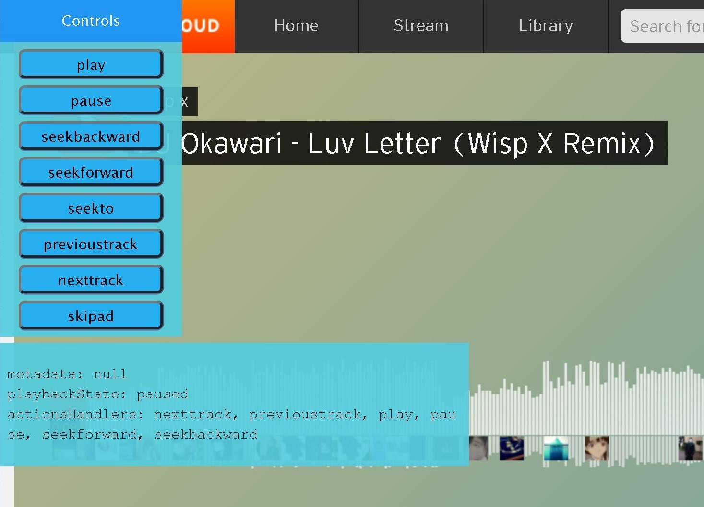

Look into how media session works

#### Refs:
https://developer.mozilla.org/en-US/docs/Web/API/Media_Session_API \
https://developer.mozilla.org/en-US/docs/Web/JavaScript/Reference/Global_Objects/Proxy \
https://github.com/JosephusPaye/chrome-media-controller/blob/master/src/extension/injected.ts \
https://javascript.plainenglish.io/inject-generic-floating-toolbar-into-any-web-application-or-site-using-playwright-d26eb116153a \
https://www.w3schools.com/howto/howto_js_draggable.asp

#### Notes:
Not sure why Spotify doesn't work - Playwright problem?

